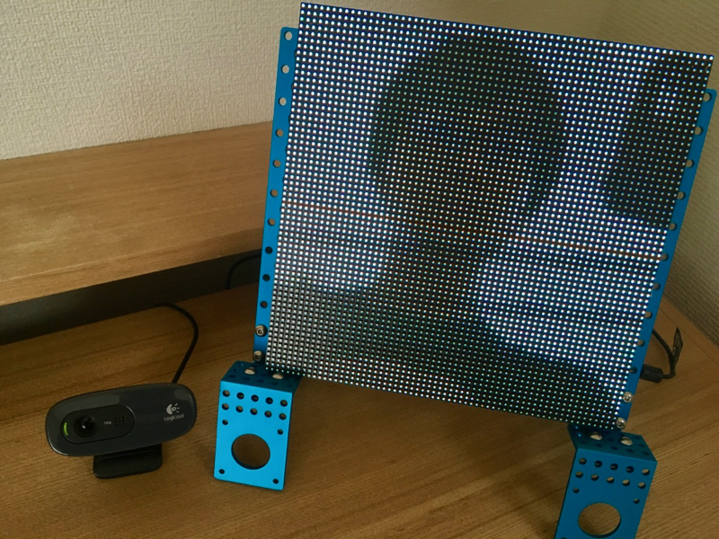

# ピクセル化装置

Raspberry Pi + openFrameworks + LED マトリクス + Web カメラの実験プロジェクト



## What's This

Raspberry Pi で、Web カメラからの入力を受け取って LED マトリクスパネルにリアルタイムで表示する装置です。実装は C++ で、openFrameworks をライブラリとして利用しています。

## Demo

こちらの [youtube](https://youtu.be/S7y5ue7JHUk) を御覧ください。

## 必要な機材

+ Raspberry Pi 3
+ LED マトリクスパネル 32x64 * 2
	+ P3 と呼ばれている事がある
+ 適当な USB Web カメラ (Logicool C270 でテストしています)
+ Adafruit RGB Matrix HAT
+ AC アダプタ (5V 10A)

## Hardware Installation


- Adafruit RGB Matrix HAT をはんだ付け
- Matrix HAT と LED パネルを接続
	- 片方の　out をもう片方の in に接続します
	- LED マトリクスパネルはデイジーチェイン接続が可能です
- Raspberry Pi に Matrix HAT を接続
- Raspberry Pi に USB Web カメラを接続

## Program Usage

- Raspberry Pi に openFrameworks をインストール
	- `of_v0.10.0_linuxarmv6l_release` で動作を確認しています　
	- openFrameworks のドキュメントに記載されている `of_v0.9.8_linuxarmv6l_release` だとコンパイルできませんでした
- [こちらのリポジトリ](https://github.com/iizukak/ofxRpiLED)を openFrameworks の `addons` ディレクトリに clone します。
	- openFrameworks で LED マトリクスパネルを使うライブラリはあるのですが、古いので改造して使っています

```
make
sudo ./bin/ofMatrixCamera
```

`sudo` がいるのは、GPIO 接続に root 権限が必要だからです。
